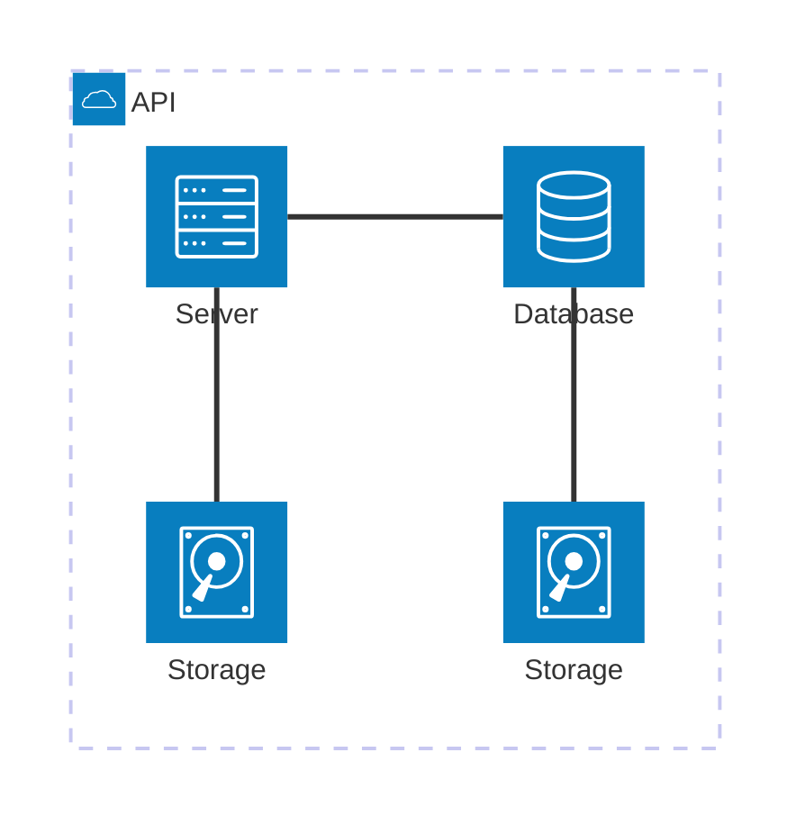

## Objetivo

O Roteiro 1 tem como objetivo introduzir o gerenciamento de hardware Bare-Metal usando a plataforma MaaS.

**Principais atividades:**
- Instalação e configuração do MaaS para gerenciar servidores físicos
- Preparação da rede do ambiente com roteador, switch e IPs fixos
- Padronização e cabeamento dos dispositivos para garantir comunicação entre os componentes

**Infraestrutura utilizada**
- 6 NUCs com diferentes configurações de CPU, RAM e armazenamento
- Switch e roteador

## Montagem do Roteiro

Os pontos "tarefas" são os passos que devem ser seguidos para a realização do roteiro. Eles devem ser claros e objetivos. Com evidências claras de que foram realizados.

### Tarefa 1

Instalando o MAAS e o UBUNTU:

Primeiramente, foi realizado a instalação do Ubuntu Server 22.04 na máquina NUC Main. Durante o processo, foi definido o hostname como main, o usuário como cloud e a senha clouds. Foi atribuido o IP fixo 172.16.0.3 e o DNS foi configurado 172.20.129.131. Após isso, foi instalado o MaaS.

<!-- termynal -->

``` bash
sudo snap install maas --channel=3.5/Stable
```


/// caption
Dashboard do MAAS
///

Conforme ilustrado acima, a tela inicial do MAAS apresenta um dashboard com informações sobre o estado atual dos servidores gerenciados. O dashboard é composto por diversos painéis, cada um exibindo informações sobre um aspecto específico do ambiente gerenciado. Os painéis podem ser configurados e personalizados de acordo com as necessidades do usuário.

### Tarefa 2

Fazendo o acesso remotamente


## App


### Tarefa 1

### Tarefa 2

Exemplo de diagrama



[Mermaid](https://mermaid.js.org/syntax/architecture.html){:target="_blank"}

## Questionário, Projeto ou Plano

Esse seção deve ser preenchida apenas se houver demanda do roteiro.

## Discussões

Quais as dificuldades encontradas? O que foi mais fácil? O que foi mais difícil?

## Conclusão

O que foi possível concluir com a realização do roteiro?
