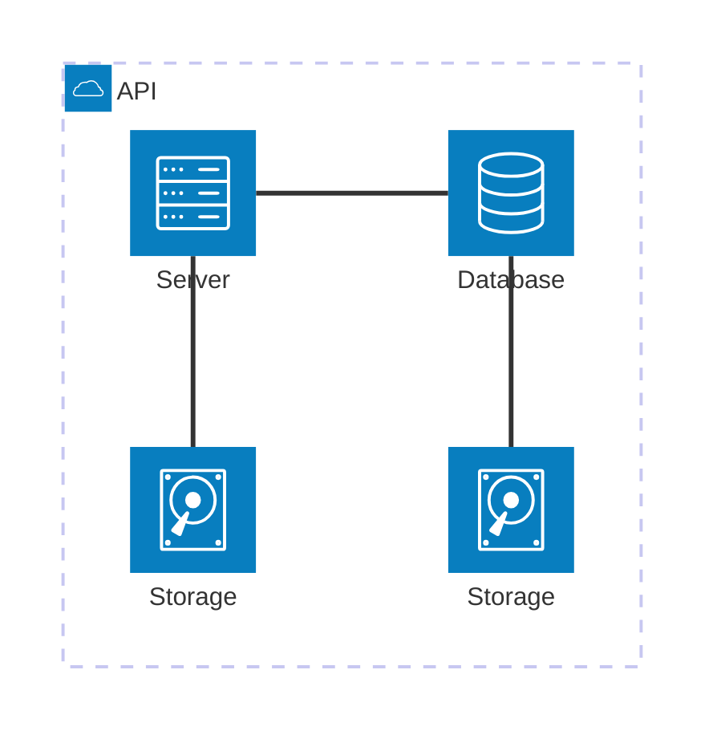

## Objetivo

O Roteiro 1 tem como objetivo introduzir o gerenciamento de hardware Bare-Metal usando a plataforma MaaS.

**Principais atividades:**
- Instalação e configuração do MaaS para gerenciar servidores físicos
- Preparação da rede do ambiente com roteador, switch e IPs fixos
- Padronização e cabeamento dos dispositivos para garantir comunicação entre os componentes

**Infraestrutura utilizada**
- 6 NUCs com diferentes configurações de CPU, RAM e armazenamento
- Switch e roteador

## Montagem do Roteiro

Os pontos "tarefas" são os passos que devem ser seguidos para a realização do roteiro. Eles devem ser claros e objetivos. Com evidências claras de que foram realizados.

### Tarefa 1

Instalando o MAAS e o UBUNTU:

Primeiramente, foi realizado a instalação do Ubuntu Server 22.04 na máquina NUC Main. Durante o processo, foi definido o hostname como main, o usuário como cloud e a senha clouds. Foi atribuido o IP fixo 172.16.0.3 e o DNS foi configurado 172.20.129.131. Após isso, foi instalado o MaaS.

<!-- termynal -->

``` bash
sudo snap install maas --channel=3.5/Stable
```


/// caption
Dashboard do MAAS
///

Conforme ilustrado acima, a tela inicial do MAAS apresenta um dashboard com informações sobre o estado atual dos servidores gerenciados. O dashboard é composto por diversos painéis, cada um exibindo informações sobre um aspecto específico do ambiente gerenciado. Os painéis podem ser configurados e personalizados de acordo com as necessidades do usuário.

### Tarefa 2

Fazendo o acesso remotamente:

Após a instalação do MaaS, acessei remotamente o MaaS dentro da rede local:
``` bash
ssh cloud@172.16.0.3
```
Foi escolhido esse endereço pois ele pertence à classe de IPs privados, que compreende o intervalo 172.16.0.0 - 172.31.255.255. Essa faixa é reservada para uso interno em redes privadas e não pode ser roteada diretamente para a internet, garantindo segurança. O roteador do kit foi configurado com o seguinte esquema de rede:
- IP do roteador (Gateway da rede): 172.16.0.1
- IP do Switch: 172.16.0.2
- IP escolhido para o NUC Main: 172.16.0.3

Em seguida, com o MaaS inicializado, foi acessado o painel web via navegador no seguinte endereço:
``` cpp
http://172.16.0.3:5240/MAAS
```
A configuração do intervalo de IPs reservados no DHCP do MaaS foi feita utilizando o seguinte intervalo:
``` 
172.16.11.1 - 172.16.14.255
```
Esse foi o intervalo pois a máscara de sub-rede é /20, o endereço de rede é 172.16.0.0 e o IP de broadcast é 172.16.15.255.

Para permitir o acesso externo ao servidor Main, foi configurado um NAT no roteador (que permite que dispositivos dentro de uma rede privada se comuniquem com redes externas) para encaminhar conexões externas via porta 22 (porta da Main). No NAT foi escolhido o seguinte IP para acessar romotamente o nosso kit: 10.103.1.28.
``` 
0.0.0.0/0
```

## App

### Tarefa 1
Primeiramente, foi mudado o DNS Server para 172.20.129.131. Esse endereço foi utilizado pelo fato de ser um servidor DNS interno do Insper.

O print acima mostra a verificação do status do PostgreSQL com o comando "sudo systemctl status postgresql" que mostra que o PostgreSQL está ativo. Em seguida, foi realizado o teste de conexão local ao PostgreSQL com o comando "psql -U cloud -h 172.16.15.0 -d tasks" (posteriormente o IP da server 1 foi mudada para 172.16.0.50), esse comando se conecta ao usuário cloud, depois se conecta ao IP do server 1 e depois se conecta ao banco de dados tasks. Para testar a conexão remota ao PostgreSQL via telnet com o comando "telnet 172.16.15.0 5432", o telnet testa se conseguimos abrir na porta 5432 do IP 172.16.15.0. A porta 5432 pelo fato de ser a porta padrão do PostgreSQL.

No print acima foi executado o comando "nmap localhost" que serve para escanear as portas abertas no localhost (server1) que fornece as portas 22 (SSH) e a porta 5432 (PostgreSQL).

O print acima mostra o comando "ping 127.0.0.1" que serve para testar a conectividade com o próprio servidor. (127.0.0.1 é o IP do localhost).
Os prints abaixo representam os mesmos de cima, mas com os demais servers.


### Tarefa 2


### Tarefa 3


Antes tinhamos apenas o server2 rodando Django e o server1 rodando o banco de dados. Após a tarefa 3, tem-se o Django também no server3. O objetivo de ter feito isso foi de possuir alta disponibilidade, pois se um node cair o outro ainda está no ar, de forma que ainda é possível acessá-lo, e balancear a carga de acesso entre os servers.

A implementação manual da aplicação do Django e do banco de dados foi realizada utilizando o script "install.sh" , responsável por instalar todas as dependências necessárias, incluindo o Django. Após a instalação, configuramos a conexão da aplicação com o banco de dados editando o arquivo settings.py do Django, onde ajustamos os parâmetros para que o sistema utilizasse corretamente o banco hospedado no server1.

Após essa etapa, desconectamos o SSH do MAAS e reconectamos à máquina cloud MAIN, criando um túnel SSH (porta 8001) para acessar o serviço Django (porta 8080) rodando no server2. Um túnel SSH funciona como uma conexão segura, permitindo redirecionar dados de uma máquina remota para a máquina local. No caso dessa implementação, esse túnel possibilitou que a aplicação Django rodando no server2 fosse acessada localmente no navegador através do endereço: http://localhost:8001/admin/. Com essa configuração, foi possível testar a interface do Django, garantindo que a aplicação estivesse conectada ao banco de dados do server1

Na tarefa 3 foi utilizado o Ansible para automatizar o deploy no server3, mas na tarefa 2 foi feita a instalação manual do Django para o server2 e foi conectado ao PostgreSQL no server1.

O Ansible foi utilizado nessa tarefa 3 por 3 motivos principais:
- Idempotente no sentido de conseguir repetir todos os procedimentos sem afetar os estados intermediários da instalação
- Fácil de se lidar com um pool de máquinas simultaneamente
- Consegue realizar o provisionamente automático de VMs e Containers (mas não metal)

### Tarefa 4


RESPOSTA:
No processo manual, foi necessário solicitar uma máquina ao MAAS, reservar instância, realizar o deploy e instalar a aplicação usando o script .sh. Esse procedimento exigiu diversas etapas manuais, o que fez a tarefa 2 ser muito pouco automatizada.

Por outro lado, o Ansible faz esse processo ser automatizado, pois o Ansible funciona como um gerenciador de deploy. Basta utilizar um arquivo .yaml contendo os requisitos necessários e executá-lo no Ansible, que configura e instala tudo.

### Tarefa 5


Na tarefa 5, o objetivo foi configurar um proxy reverso com load balancer utilizando o NGINX no server4. Isso permite que as requisições sejam distribuídas entre os server2 e o server3, que executam a aplicação Django. O balanceamento foi configurado no modelo Round Robin, garantindo que cada nova requisição seja redirecionada para um servidor diferente.

### Conclusão
O MAAS é uma ferramenta útil para o gerenciamento de servidores físicos em escala, como seria o caso de um datacenter real. Ele automatiza tarefas como descoberta, provisionamento, comissionamento e configuração de máquinas, além de fornecer controle centralizado sobre rede, IPs e armazenamento. Sem o MAAS, esse processo seria muito mais manual e demorado, fazendo com que cada servidor fosse instalado manualmente.

Apesar do MAAS facilitar bastante a preparação da infraestrutura, ele não é uma ferramenta de deploy de aplicações. Por isso, para instalar e configurar a aplicação Django, foi usado um script manual (install.sh) e depois o Ansible para automatizar o mesmo processo.

Exemplo de diagrama



[Mermaid](https://mermaid.js.org/syntax/architecture.html){:target="_blank"}

## Questionário, Projeto ou Plano

Esse seção deve ser preenchida apenas se houver demanda do roteiro.

## Discussões

Quais as dificuldades encontradas? O que foi mais fácil? O que foi mais difícil?

## Conclusão

O que foi possível concluir com a realização do roteiro?
