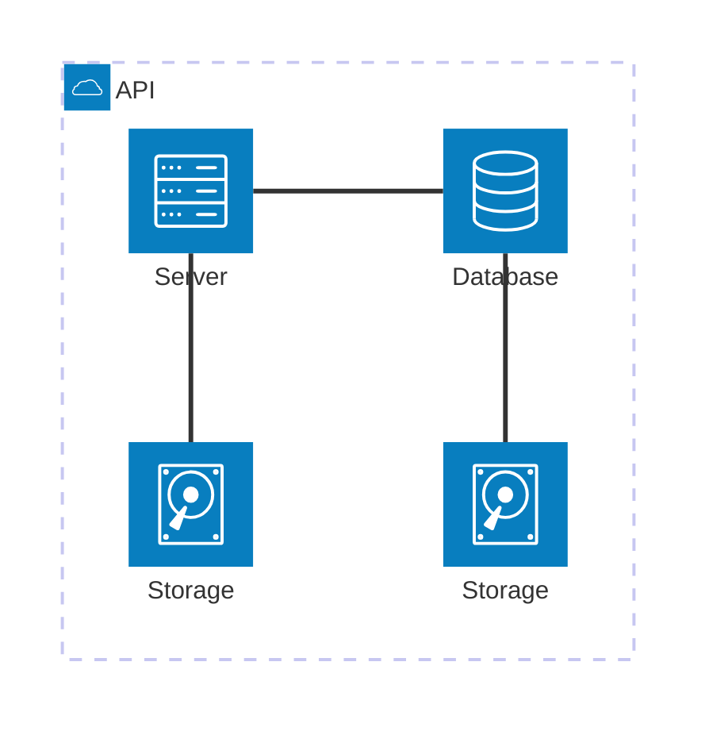

## Objetivo

O Roteiro 1 tem como objetivo introduzir o gerenciamento de hardware Bare-Metal usando a plataforma MaaS.

**Principais atividades:**
- Instalação e configuração do MaaS para gerenciar servidores físicos
- Preparação da rede do ambiente com roteador, switch e IPs fixos
- Padronização e cabeamento dos dispositivos para garantir comunicação entre os componentes

**Infraestrutura utilizada**
- 6 NUCs com diferentes configurações de CPU, RAM e armazenamento
- Switch e roteador

## Montagem do Roteiro

Os pontos "tarefas" são os passos que devem ser seguidos para a realização do roteiro. Eles devem ser claros e objetivos. Com evidências claras de que foram realizados.

### Tarefa 1

Instalando o MAAS e o UBUNTU:

Primeiramente, foi realizado a instalação do Ubuntu Server 22.04 na máquina NUC Main. Durante o processo, foi definido o hostname como main, o usuário como cloud e a senha clouds. Foi atribuido o IP fixo 172.16.0.3 e o DNS foi configurado 172.20.129.131. Após isso, foi instalado o MaaS.

<!-- termynal -->

``` bash
sudo snap install maas --channel=3.5/Stable
```


/// caption
Dashboard do MAAS
///

Conforme ilustrado acima, a tela inicial do MAAS apresenta um dashboard com informações sobre o estado atual dos servidores gerenciados. O dashboard é composto por diversos painéis, cada um exibindo informações sobre um aspecto específico do ambiente gerenciado. Os painéis podem ser configurados e personalizados de acordo com as necessidades do usuário.

### Tarefa 2

Fazendo o acesso remotamente:

Após a instalação do MaaS, acessei remotamente o MaaS dentro da rede local:
``` bash
ssh cloud@172.16.0.3
```
Foi escolhido esse endereço pois ele pertence à classe de IPs privados, que compreende o intervalo 172.16.0.0 - 172.31.255.255. Essa faixa é reservada para uso interno em redes privadas e não pode ser roteada diretamente para a internet, garantindo segurança. O roteador do kit foi configurado com o seguinte esquema de rede:
- IP do roteador (Gateway da rede): 172.16.0.1
- IP do Switch: 172.16.0.2
- IP escolhido para o NUC Main: 172.16.0.3

Em seguida, com o MaaS inicializado, foi acessado o painel web via navegador no seguinte endereço:
``` cpp
http://172.16.0.3:5240/MAAS
```
A configuração do intervalo de IPs reservados no DHCP do MaaS foi feita utilizando o seguinte intervalo:
``` 
172.16.11.1 - 172.16.14.255
```
Esse foi o intervalo pois a máscara de sub-rede é /20, o endereço de rede é 172.16.0.0 e o IP de broadcast é 172.16.15.255.

Para permitir o acesso externo ao servidor Main, foi configurado um NAT no roteador (que permite que dispositivos dentro de uma rede privada se comuniquem com redes externas) para encaminhar conexões externas via porta 22 (porta da Main).
``` 
0.0.0.0/0
```

## App


### Tarefa 1

### Tarefa 2

Exemplo de diagrama



[Mermaid](https://mermaid.js.org/syntax/architecture.html){:target="_blank"}

## Questionário, Projeto ou Plano

Esse seção deve ser preenchida apenas se houver demanda do roteiro.

## Discussões

Quais as dificuldades encontradas? O que foi mais fácil? O que foi mais difícil?

## Conclusão

O que foi possível concluir com a realização do roteiro?
